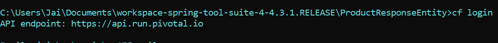
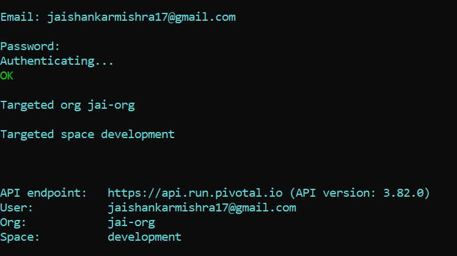
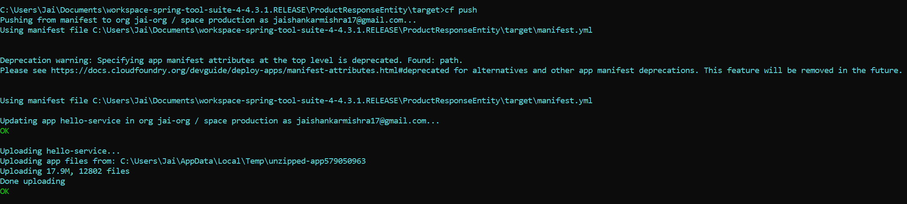
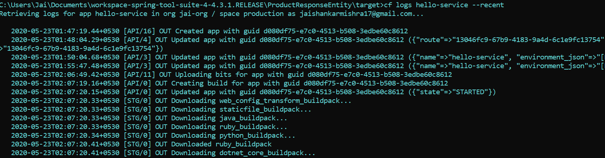

# PCF Deployment

* Open the command terminal and use the following command.  
``` 
cf login
```

***
* It will ask for Cloud Foundry API. Enter The following API value-
* Next it will ask you for the Cloud Foundry credentials  

***
* Go to the project target location and using the following command push the jar file to PCF for deployment  
```
cf push
```

***
* for PCF logs use the following command  
```
cf logs <app-name> --recent
```

